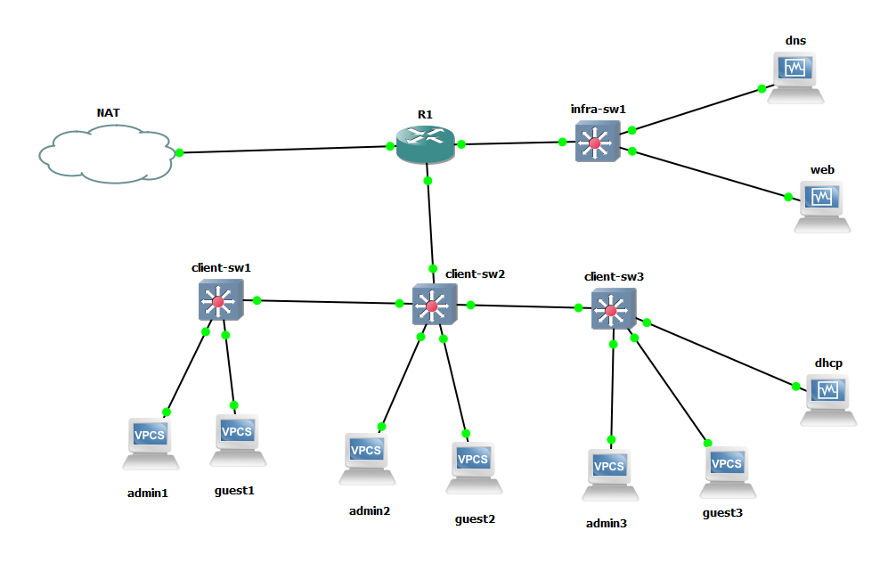
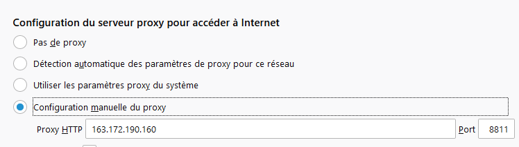

# B2 reseaux Tp4

## Sujet global : refresh

La topologie a été mis en place :

Les clients du réseaux se joignent et joignent le WAN.

## 5. Anonymat en ligne 

### Proxy HTTP 

Configuration du proxy HTTP.

